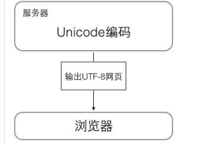

# python深入学习

---

[toc]


- [ ] 学习30分钟

### python基础

----

#### 数据类型变量

==不转义字符`print(r"i am \\ ok ")`==

```python
ord()//获取字符的整数
chr()//编码变字符
//由于Python的字符串类型是str，在内存中以Unicode表示，一个字符对应若干个字节。如果要在网络上传输，或者保存到磁盘上，就需要把str变为以字节为单位的bytes
x=b'abc'//每个字符对应一个字节


//str通过编码方式变为bytes
'abc'.encode('ascii')
//中文通过utf—8转为bytes
'中文'.encode('utf-8')


//bytes变为str
b'abc'.decode('ascii')


```

> 在计算机内存中，统一使用Unicode编码，当需要保存到硬盘或者需要传输的时候，就转换为UTF-8编码。




#### 类型转化

> input 输入的是str int转化为整数


#### len()函数

==对于str是计算字符数 对于bytes是计算字节数==


### list

> list的元素数据类型可以不同
>
> list=['jskdjfkd','sjfdkjfkd]

```pyton
//添加元素
list.append('test')
//添加元素到指定的位置
list.insert(1,'test')
//删除末尾的元素
list.pop()
//删除指定位置的元素
list.pop(i)

```


### tuple

> 一旦初始化就不能改变

==只有一个元素的元组定义的时候为了歧义必须加逗号==

`t=(1,)`

### 条件判断

```python
if:
    
    else:
elif:// else if的缩写
```

### 循环

==for..in循环==

`for i in test:`

#### range函数

> range(101) //0到100的整数序列

==while循环==

### dict

> k-v结构数据

==判读key是否存在==

1. `key in dict`
2. `dict.get(key)`

==删除key的同时value也同时删除==

`dict.pop(key)`


#### list和dict的区别

>和list比较，dict有以下几个特点：
>
>1. 查找和插入的速度极快，不会随着key的增加而变慢；
>2. 需要占用大量的内存，内存浪费多。
>
>而list相反：
>
>1. 查找和插入的时间随着元素的增加而增加；
>2. 占用空间小，浪费内存很少。
>
>所以，dict是用空间来换取时间的一种方法

### set

>set和dict类似，也是一组key的集合，但不存储value。由于key不能重复，所以，在set中，没有重复的key。
>
>要创建一个set，需要提供一个list作为输入集合
>
>

==添加元素==

`add(key)`

==删除元素==

`remove(key)`

### 可变对象和不可变对象

> set和dict中的key必须为不可变对象
>
> list是可变对象

### 函数

==必须有返回值 当无需返回时候直接`return`==

#### 数据类型检查函数 isinstance

```pyton
def my_abs(x):
    if not isinstance(x, (int, float)):
        raise TypeError('bad operand type')
    if x >= 0:
        return x
    else:
        return -x

```

==返回多个值==

> 实际上返回多个值得时候是返回一个tuble

#### 函数参数

==默认参数==

```python
def power(x, n=2):
    s = 1
    while n > 0:
        n = n - 1
        s = s * x
    return s
```

==默认参数必须是不变对象==

#### 可变参数

```python
def calc(*numbers):
    sum = 0
    for n in numbers:
        sum = sum + n * n
    return sum
```

==numbers接受到的是一个tubles,可以传入任意多个参数==

==list和tubles作为参数传递==

> Python允许你在list或tuple前面加一个`*`号，把list或tuple的元素变成可变参数传进去：
>
> 

```
nums = [1, 2, 3]
calc(*nums)
14
```

#### 关键字参数

> 可变参数允许你传入0个或任意个参数，这些可变参数在函数调用时自动组装为一个tuple。而关键字参数允许你传入0个或任意个含参数名的参数，这些关键字参数在函数内部自动组装为一个dict
>
> 

```python
def person(name, age, **kw):
    print('name:', name, 'age:', age, 'other:', kw)


>>> extra = {'city': 'Beijing', 'job': 'Engineer'}
>>> person('Jack', 24, city=extra['city'], job=extra['job'])
name: Jack age: 24 other: {'city': 'Beijing', 'job': 'Engineer'}
            
 //简化

>> extra = {'city': 'Beijing', 'job': 'Engineer'}
>>> person('Jack', 24, **extra)
name: Jack age: 24 other: {'city': 'Beijing', 'job': 'Engineer'}
```

