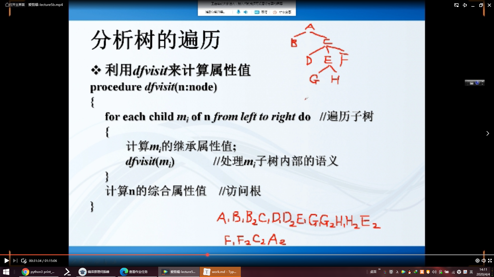

1、请写出地址FEC0:0000:0000:0001:02AA:0000:0000:007A更简洁的表达方式。

2、对于一个全局管理的单播IEEE 802地址0C-1C-09-A8-F9-CE，写出其基于EUI-64的IPV6接口标识符、对应的本地链路地址和对应的请求节点组播地址。

扩充到64 

UL取反

3、对于本地管理的单播EUI-64地址02-00-00-00-00-00-00-09，写出其对应的IPVv6接口标识符和对应的链路本地地址。

77

在IPV6中，是否存在与IPV4头部的IHL 字段等价的字段？

***DFA NFA***

***

右边的最左边是终结符

可归前缀是以句柄结尾的前缀

移入项目：点后面是终结符

归约项目：点后没有东西

待约项目：点后是非终结符

LR（0）：要么移入要么规约 无需考虑后继 归约时候不需要考虑了follow集合直接全部填r

构建自动机步骤：

1. 引入开始符 得到增广文法
2. 编号
3. 构建自动机 表or图 状态数少用图 状态多用表

​				4.分析表

​       例子：

***SLR(自动机)***

1. 变为增广文法

2. 编号 求FOLLOW集合

3. 图

   

有直接左递归的不是ll1自动机

移入规约冲突（合并同心集不会出现）

第一次进是继承属性 第二次是综合属性

